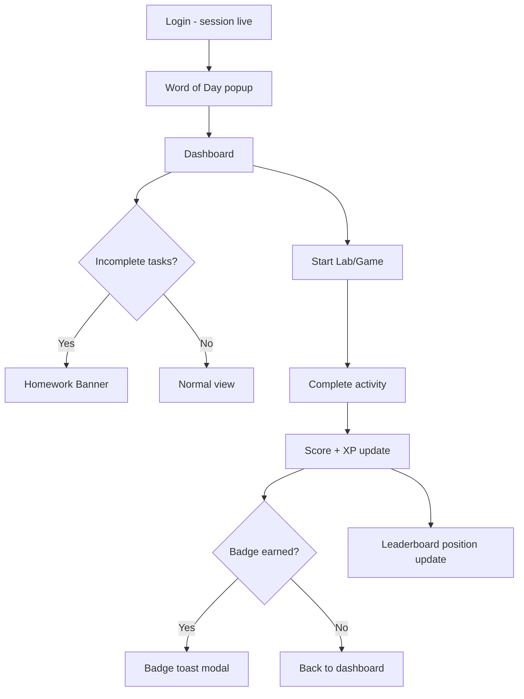
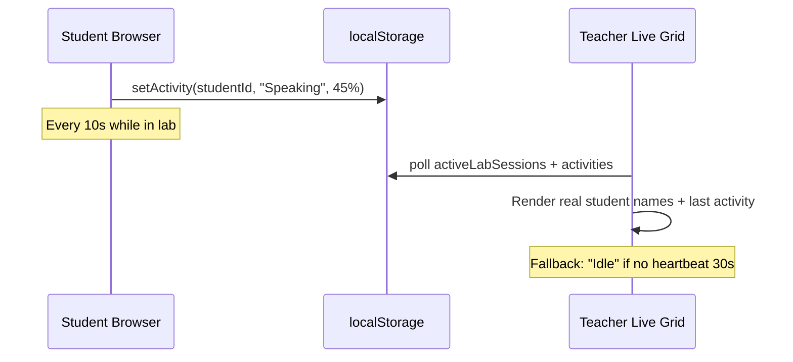

# LSRW — Frontend Implementation Plan

> **Scope:** Sirf frontend abhi. Saari screens, flows, aur functions UI par dikhenge aur kaam karenge — data `localStorage` + React Context se. Backend baad mein plug hoga.
>
> **Reference:** [`planning.md`](./planning.md) — product vision  
> **Rule:** Har feature pehle frontend-complete → phir API stub replace

---

## 0. Approach — Frontend Pehle, Backend Baad Mein

### Kaise kaam karega (abhi)

```
┌─────────────┐     ┌──────────────────┐     ┌─────────────────┐
│   UI Pages  │ ──► │  Context/Reducer │ ──► │  localStorage   │
│  Components │     │  + mock services │     │  (persist)      │
└─────────────┘     └──────────────────┘     └─────────────────┘
                              │
                              ▼
                    ┌──────────────────┐
                    │  src/api/stubs   │  ← baad mein real fetch
                    │  (same interface)│
                    └──────────────────┘
```

### Principles
| Rule | Detail |
|------|--------|
| **Ek data layer** | `App` students + `CrmContext` ko merge karo → `AppStoreContext` |
| **API stubs** | `src/api/*.ts` — abhi localStorage; baad mein `fetch()` |
| **Real flows** | Button click → state update → UI refresh → persist |
| **No fake toggles** | "Reviewed" sirf UI change na ho — CRM mein save ho |
| **Demo label** | Jo abhi simulated hai us par chhota badge: `Demo` ya `Local` |

### localStorage keys (planned)
| Key | Data |
|-----|------|
| `lsrw-gov-lab-crm-v1` | tasks, reports, sessions (existing) |
| `lsrw-app-state-v1` | students, teachers, scores, XP, streak, badges |
| `lsrw-submissions-v1` | writing + speaking submissions |
| `lsrw-attendance-v1` | per session per student |
| `lsrw-live-activity-v1` | student current lab activity (for teacher monitor) |
| `lsrw-badges-v1` | earned badges per student |
| `lsrw-school-profile-v1` | school name, logo URL, academic year |

---

## 1. Folder Structure (Target)

```
src/
├── api/                          # NEW — backend stubs
│   ├── client.ts                 # future: base URL, auth header
│   ├── students.ts
│   ├── teachers.ts
│   ├── tasks.ts
│   ├── submissions.ts
│   ├── sessions.ts
│   └── index.ts
├── context/
│   ├── CrmContext.tsx            # extend
│   └── AppStoreContext.tsx       # NEW — students, XP, badges unified
├── types/
│   ├── crm.ts                    # extend
│   ├── student.ts                # NEW
│   ├── teacher.ts                # NEW
│   └── submissions.ts            # NEW
├── lib/
│   ├── persist.ts                # extend keys
│   ├── scoring.ts                # NEW — XP, streak, badge rules
│   └── liveActivity.ts           # NEW — student heartbeat mock
├── data/
│   ├── wordOfTheDay.ts
│   ├── dailyTaskCatalog.ts
│   ├── listeningClips.ts         # NEW — mock audio metadata + TTS fallback
│   ├── readingPassages.ts        # NEW — passages + MCQ
│   ├── badges.ts                 # NEW — badge definitions
│   └── phonicsContent.ts         # NEW — class 1-2
├── components/
│   ├── Chatbot.tsx
│   ├── WordOfDayModal.tsx
│   ├── Leaderboard.tsx           # NEW
│   ├── BadgeGrid.tsx             # NEW
│   ├── HomeworkBanner.tsx        # NEW
│   ├── HindiHintToggle.tsx       # NEW
│   └── SessionTimer.tsx          # NEW
├── features/
│   ├── student/
│   │   ├── labs/                 # extend — score callback, submissions
│   │   ├── games/                # extend — score callback
│   │   ├── LeaderboardPage.tsx   # NEW
│   │   ├── BadgesPage.tsx        # NEW
│   │   └── PhonicsModule.tsx     # NEW
│   ├── teacher/
│   │   ├── DailyTaskDesk.tsx     # extend — custom task
│   │   ├── SubmissionInbox.tsx   # NEW
│   │   ├── AttendancePanel.tsx   # NEW
│   │   ├── ClassSnapshot.tsx     # NEW
│   │   └── LiveMonitoring.tsx    # extract from App.tsx
│   └── admin/
│       ├── SchoolCrmReports.tsx
│       ├── TeacherManagement.tsx # NEW
│       ├── SchoolProfile.tsx     # NEW
│       └── AcademicYear.tsx      # NEW
└── App.tsx                       # slim down — route views only
```

---

## 2. Sprint Plan (Frontend Only)

### Sprint 0 — Foundation (2–3 din) ⚙️
**Goal:** Data layer fix — sab features is par build honge

| # | Task | Files | Done |
|---|------|-------|------|
| 0.1 | Students ko localStorage mein persist karo (reload par na ude) | `lib/persist.ts`, `App.tsx` | [x] |
| 0.2 | `AppStoreContext` — students, XP, streak, coins, scores ek jagah | `context/AppStoreContext.tsx` | [x] |
| 0.3 | `src/api/` stub layer — same function signatures jo backend use karega | `api/*.ts` | [x] |
| 0.4 | Types extend: `Submission`, `Badge`, `AttendanceRecord`, `LiveActivity` | `types/*.ts` | [x] |
| 0.5 | `scoring.ts` — lab complete → XP + skill score update rules | `lib/scoring.ts` | [x] |

**Flow after Sprint 0:**
```
Student completes lab → onComplete(score, skill) → scoring.ts
  → update student.scores, xp, streak → save localStorage → dashboard refresh
```

---

### Sprint 1 — Student Core (4–5 din) 🎓
**Goal:** Student panel fully interactive — scores, leaderboard, badges, reminders

| # | Feature | UI | Data / Flow | Files |
|---|---------|-----|-------------|-------|
| 1.1 | **Real score update** | Lab end screen: score + XP gained toast | `completeLab(studentId, skill, score)` | labs/*, games/*, `scoring.ts` | [x] |
| 1.2 | **Leaderboard** | New sidebar item "Leaderboard" — top 10 class-wise | Sort students by XP in same class-section | `Leaderboard.tsx` | [x] |
| 1.3 | **Badges page** | Grid of earned + locked badges | Rules: 7-day streak, 80+ speaking, etc. | `badges.ts`, `BadgeGrid.tsx` | [x] |
| 1.4 | **Homework reminder** | Orange banner on dashboard if tasks incomplete | Check published tasks vs completedBy | `HomeworkBanner.tsx` | [x] |
| 1.5 | **Hindi hint toggle** | Toggle in header/settings — words show Hindi | Context flag `showHindiHints` | `HindiHintToggle.tsx` | [x] |
| 1.6 | **Remove misleading UI** | "Top 28%" → "Class Rank #3" (real calc) | Rank from class XP sort | `App.tsx` StudentHome | [x] |
| 1.7 | **Task → Lab link** | Mark Done only after lab score recorded OR manual confirm | Task completion tied to skill session | `DailyTasks.tsx` | [x] |

**Student flows (Sprint 1):**



---

### Sprint 2 — Student Content (4–5 din) 📚 ✅
**Goal:** Listening quiz, reading comprehension, per-class feel

| # | Feature | UI | Mock data | Files |
|---|---------|-----|-----------|-------|
| 2.1 | **Listening — clip library** | Clip title, duration, "Play" (TTS as stand-in for MP3) | `listeningClips.ts` — 4 clips per band | `ListeningLab.tsx` | [x] |
| 2.2 | **Listening quiz** | Already partial — wire score to CRM | MCQ in clip data | `ListeningLab.tsx` | [x] |
| 2.3 | **Reading comprehension** | Passage + 3–5 MCQ after read | `readingPassages.ts` per band | `ReadingLab.tsx` | [x] |
| 2.4 | **Per-class content** | Class number in data lookup (not just profile band) | Extend content keys: `class-5`, `class-8` | labs content files | [x] |
| 2.5 | **Writing submit → queue** | Submit button saves to submissions store | `Submission` type, localStorage | `WritingLab.tsx`, `api/submissions.ts` | [x] |
| 2.6 | **Speaking submit → queue** | Save transcript + score + optional recording blob URL | Same submissions store | `SpeakingLab.tsx` | [x] |

**Submission object (frontend):**
```typescript
type Submission = {
  id: string;
  studentId: string;
  studentName: string;
  classNumber: number;
  section: "A" | "B";
  skill: "Speaking" | "Writing";
  title: string;
  content: string;        // essay text or speaking transcript
  score?: number;         // auto score from lab
  status: "pending" | "reviewed";
  teacherScore?: number;
  teacherComment?: string;
  submittedAt: string;
};
```

---

### Sprint 3 — Teacher Panel (5–6 din) 👩‍🏫 ✅
**Goal:** Teacher ka poora workflow frontend par complete

| # | Feature | UI | Flow | Files |
|---|---------|-----|------|-------|
| 3.1 | **Submission Inbox** | New tab "Submissions" — list pending writing/speaking | Load from `lsrw-submissions-v1` | `SubmissionInbox.tsx` | [x] |
| 3.2 | **Review modal** | Score 1–5 + comment + "Mark Reviewed" | Update submission status | `SubmissionInbox.tsx` | [x] |
| 3.3 | **Pending Reviews tab fix** | Real data from inbox — remove hardcoded 8 | Count `status: pending` | `App.tsx` → extract | [x] |
| 3.4 | **Custom task create** | Form in Daily Task Desk: title, skill, prompt, due date | Add to draft tasks | `DailyTaskDesk.tsx` | [x] |
| 3.5 | **Attendance panel** | Session start par modal: student list Present/Absent/Late | Save `AttendanceRecord[]` | `AttendancePanel.tsx` | [x] |
| 3.6 | **Class snapshot** | One card: avg score, weak skill, % tasks done today | Aggregate from store | `ClassSnapshot.tsx` | [x] |
| 3.7 | **Session timer** | Live monitoring header: elapsed MM:SS from `startedAt` | Real calc, end par save duration | `SessionTimer.tsx`, `LiveMonitoring` | [x] |
| 3.8 | **Export class report** | Button → download Excel (SheetJS) | Same as admin export but scoped | `teacher/ClassExport.tsx` | [x] |
| 3.9 | **Word of Day preview** | Small card on teacher dashboard | `getWordForDate(today)` | `TeacherHome` | [x] |
| 3.10 | **Live monitoring — local activity** | Student client writes activity on lab open | `liveActivity.ts` + interval read | `lib/liveActivity.ts`, teacher grid | [x] |

**Teacher live monitoring flow (frontend mock):**



**Student side (heartbeat):**
```typescript
// hooks/useLiveActivity.ts
useEffect(() => {
  if (!sessionActive) return;
  const tick = () => writeActivity({ studentId, skill, progress });
  tick();
  const id = setInterval(tick, 10000);
  return () => clearInterval(id);
}, [skill, progress]);
```

---

### Sprint 4 — Admin Panel (3–4 din) 🏫 ✅
**Goal:** School setup screens — sab frontend par

| # | Feature | UI | Flow | Files |
|---|---------|-----|------|-------|
| 4.1 | **Teacher Management** | CRUD table: add/edit/deactivate teacher | Save to `app-state` teachers array | `TeacherManagement.tsx` | [x] |
| 4.2 | **School Profile** | Form: school name, logo URL, address | Save + show on reports header | `SchoolProfile.tsx` | [x] |
| 4.3 | **Academic Year** | Dropdown: 2025-26, Term 1/2/3 | Filter reports by term | `AcademicYear.tsx` | [x] |
| 4.4 | **Allotments sync** | Teacher CRUD se allotments auto-link | One source of truth | `TeacherManagement.tsx` | [x] |
| 4.5 | **Rename Super Admin** | UI text → "School Admin" | Copy change | `App.tsx` | [x] |
| 4.6 | **Real heatmap data** | Completion % from actual task completions | Already partial — wire to AppStore | `SchoolCrmReports.tsx` | [x] |
| 4.7 | **Announcement banner** | Admin message → student dashboard top | `announcements[]` in store | `admin/Announcements.tsx` | [x] |

---

### Sprint 5 — Engagement & Junior Content (4–5 din) 🎮 ✅
**Goal:** Class 1–4 extra + Class 9–12 advanced UI

| # | Feature | Class | Files |
|---|---------|-------|-------|
| 5.1 | **Phonics module** | 1–2 | `PhonicsModule.tsx`, `phonicsContent.ts` | [x] |
| 5.2 | **Story mode** | 1–4 | Picture slides + TTS read-along | [x] |
| 5.3 | **Spelling bee** | 3–6 | Weekly word list mini-game | [x] |
| 5.4 | **Debate / GD practice** | 9–12 | Topic card + 2 min timer + record | [x] |
| 5.5 | **Mock interview** | 11–12 | Question deck + speaking lab extended | [x] |
| 5.6 | **Personal learning path** | 5–12 | Weak skill card: "Practice more Listening" | [x] |
| 5.7 | **Parent report link** | All | Generate shareable URL hash → read-only report page | [x] |

**Parent link flow (no backend):**
```
/admin or /teacher → "Copy parent link" 
→ URL: /report/share/{studentId}/{token}
→ token = btoa(studentId + date) — demo only
→ Public read-only page: scores, attendance, remarks
```

---

### Sprint 6 — Polish & Refactor (3–4 din) ✨ ✅
**Goal:** Production-feel demo, code cleanup

| # | Task | Detail |
|---|------|--------|
| 6.1 | Extract `LiveMonitoring`, `TeacherHome`, `StudentHome` from `App.tsx` | Smaller files | [x] |
| 6.2 | Chatbot update — only real features list | `Chatbot.tsx` | [x] |
| 6.3 | Empty states everywhere | No tasks, no submissions, etc. | [x] |
| 6.4 | Loading skeletons | Framer Motion placeholders | [x] |
| 6.5 | Toast notifications | `sonner` or simple toast context | [x] |
| 6.6 | Responsive pass | Mobile sidebar collapse | [x] |
| 6.7 | "Demo mode" badges | Simulated features labeled | [x] |
| 6.8 | Reset demo data button | Admin → clear localStorage | [x] |

---

## 3. Screen Map — Kya Dikhega (Final UI)

### Student Sidebar (after all sprints)
| # | Nav Item | Status |
|---|----------|--------|
| 1 | Dashboard | ✅ exists → enhance |
| 2 | Today's Tasks | ✅ exists → link to lab completion |
| 3 | Daily Report | ✅ exists |
| 4 | Leaderboard | 🆕 Sprint 1 |
| 5 | My Badges | 🆕 Sprint 1 |
| 6 | Phonics / Story | ✅ Sprint 5 (class 1–4 only) |
| 7–10 | LSRW Labs/Games | ✅ exists → score wiring |

### Teacher Tabs (after all sprints)
| # | Tab | Status |
|---|-----|--------|
| 1 | Daily Tasks | ✅ → custom task |
| 2 | Teacher Dashboard | ✅ → snapshot + WOTD |
| 3 | Live Monitoring | ✅ → real heartbeat |
| 4 | Submissions | 🆕 Sprint 3 |
| 5 | Attendance | 🆕 Sprint 3 |
| 6 | Roster | ✅ exists |
| 7 | Reviews | ✅ → real inbox data |

### Admin Tabs (after all sprints)
| # | Tab | Status |
|---|-----|--------|
| 1 | Overview | ✅ |
| 2 | School Profile | ✅ Sprint 4 |
| 3 | Teachers | ✅ Sprint 4 |
| 4 | Bulk Onboarding | ✅ |
| 5 | Students | ✅ |
| 6 | Reports | ✅ → real data |
| 7 | School CRM | ✅ |
| 8 | Announcements | ✅ Sprint 4 |

---

## 4. Data Models to Add

```typescript
// types/submissions.ts
export type Submission = { /* see Sprint 2 */ };

// types/student.ts
export type StudentProfile = {
  id: string;
  name: string;
  classNumber: number;
  section: "A" | "B";
  scores: Scores;
  xp: number;
  streak: number;
  lastActiveDate: string;
  badges: string[];       // badge ids earned
  coins: number;
};

// types/attendance.ts
export type AttendanceRecord = {
  date: string;
  classNumber: number;
  section: "A" | "B";
  studentId: string;
  status: "present" | "absent" | "late";
  markedBy: string;     // teacherId
};

// types/live.ts
export type LiveActivity = {
  studentId: string;
  skill: Skill | "Idle";
  progress: number;       // 0-100
  updatedAt: string;
};

// types/badges.ts
export type BadgeDef = {
  id: string;
  title: string;
  description: string;
  icon: string;
  rule: "streak_7" | "speaking_80" | "wpm_100" | "all_tasks_day";
};

// types/school.ts
export type SchoolProfile = {
  name: string;
  logoUrl?: string;
  address: string;
  academicYear: string;
  term: "1" | "2" | "3";
};
```

---

## 5. API Stubs (Backend Baad Mein Replace)

Har file mein same exports — abhi localStorage, baad mein fetch:

```typescript
// api/submissions.ts
export async function getSubmissions(teacherScope: ClassSection[]): Promise<Submission[]> {
  // NOW: return loadSubmissions().filter(in scope)
  // LATER: return fetch('/api/submissions').then(r => r.json())
}

export async function reviewSubmission(id: string, score: number, comment: string): Promise<void> {
  // NOW: update localStorage
  // LATER: PATCH /api/submissions/:id
}
```

**Stub files to create:**
| File | Functions |
|------|-----------|
| `api/students.ts` | `getStudents`, `updateStudent`, `getLeaderboard` |
| `api/tasks.ts` | `getTasks`, `publishTasks`, `completeTask` |
| `api/submissions.ts` | `getSubmissions`, `createSubmission`, `reviewSubmission` |
| `api/sessions.ts` | `startSession`, `endSession`, `getActiveSessions` |
| `api/attendance.ts` | `markAttendance`, `getAttendance` |
| `api/teachers.ts` | `getTeachers`, `createTeacher`, `updateTeacher` |
| `api/school.ts` | `getSchoolProfile`, `updateSchoolProfile` |

---

## 6. Key User Flows (End-to-End Frontend)

### Flow A — Poora lab period (school day)
```
1. Teacher login
2. Teacher Dashboard → Start Lab Session (Class 12-A)
3. Attendance modal → mark present/absent
4. Students login (gate open)
5. Word of Day popup → student dashboard
6. Student opens Speaking Lab → heartbeat starts
7. Teacher Live Monitoring → sees "Rohan - Speaking 60%"
8. Student submits writing → Submission Inbox
9. Teacher reviews → score + comment
10. Student XP + badge update
11. Teacher End Session → real timer duration saved
12. Admin CRM → session history updated
```

### Flow B — Daily task cycle
```
1. Teacher → Daily Tasks → Generate AI pack → edit → Publish
2. Student → Today's Tasks → sees 4 tasks
3. Student → Start → opens matching lab
4. Lab complete → score saved → "Mark Done" enabled
5. Student → Mark Done
6. Daily Report → tasks completed + time updated
7. Homework banner disappears
```

### Flow C — Admin onboarding
```
1. Admin → Download Excel template
2. Fill rows → Upload → Validate
3. Confirm → students added to store (persisted)
4. Export credentials → give to school
5. Assign teacher to class in Teacher Management
6. Teacher can now start session for that class
```

---

## 7. Kya NAHI Karna Abhi (Backend Scope)

| Feature | Frontend abhi | Backend baad mein |
|---------|---------------|-------------------|
| Real JWT login | Mock login rakho | `/auth/login` |
| Real MP3 files | TTS + clip metadata UI | S3 + CDN URLs |
| Pronunciation API | Word-match heuristic | Azure/Google Speech |
| WebSocket live | localStorage polling (10s) | Socket.io room per class |
| LLM writing feedback | Regex rules | OpenAI API |
| Multi-school | Single school demo | Tenant ID in DB |
| Email/SMS parent link | Copy URL clipboard | Notification service |

---

## 8. Testing Checklist (Manual — Frontend)

### Student
- [ ] Login blocked jab session inactive
- [ ] Login allowed jab teacher ne start kiya
- [ ] Word of Day sirf ek baar aata hai
- [ ] Lab complete → XP/score dashboard par badla
- [ ] Leaderboard class ke students dikhata hai
- [ ] Badge earn hone par toast
- [ ] Incomplete task → banner dikhe
- [ ] Writing submit → teacher inbox mein dikhe
- [ ] Listening clip library se clip choose + quiz score save
- [ ] Reading passage ke baad MCQ + combined WPM score save

### Engagement
- [ ] Class 1–2 Phonics quiz score save
- [ ] Story mode read-along + finish
- [ ] Spelling bee weekly list
- [ ] Debate 2-min timer + speaking score
- [ ] Mock interview question deck
- [ ] Class 5+ learning path weak-skill card
- [ ] Copy parent link → read-only report page

### Teacher
- [ ] Custom task add + publish
- [ ] Attendance save + reload par rahe
- [ ] Live grid student activity dikhaye (same browser test)
- [ ] Submission review save ho
- [ ] End session → real duration save
- [ ] Export Excel download ho

### Admin
- [ ] New teacher add → login list mein dikhe
- [ ] School name report par dikhe
- [ ] Bulk upload students persist after reload
- [ ] Announcement student dashboard par dikhe

---

## 9. Timeline Summary

| Sprint | Duration | Deliverable |
|--------|----------|-------------|
| **0** Foundation | 2–3 days | Persist students, AppStore, API stubs, scoring |
| **1** Student core | 4–5 days | Scores, leaderboard, badges, homework banner |
| **2** Student content | 4–5 days | Listening/reading quiz, submissions queue |
| **3** Teacher panel | 5–6 days | Inbox, attendance, live heartbeat, export |
| **4** Admin panel | 3–4 days | Teachers CRUD, school profile, announcements |
| **5** Engagement | 4–5 days | Phonics, debate, interview, parent link |
| **6** Polish | 3–4 days | Refactor App.tsx, toasts, responsive |
| **Total** | **~25–32 days** | Full frontend product demo |

---

## 10. Pehla Kaam — Aaj Se Shuru (Sprint 0)

Priority order agar ek-ek karoge:

1. **`lib/persist.ts`** — `saveAppState` / `loadAppState` for students  
2. **`context/AppStoreContext.tsx`** — merge student state + CRM  
3. **`lib/scoring.ts`** — `onLabComplete(studentId, skill, score)`  
4. **`SpeakingLab.tsx`** — call `onLabComplete` on finish  
5. **Same for** Listening, Reading, Writing, 4 games  
6. **Dashboard** — show updated XP/scores immediately  

Uske baad Sprint 1 (Leaderboard + Badges) start karo.

---

## 11. Backend Integration Checklist (Future — Reference Only)

Jab backend ready ho, sirf yeh replace karna hai:

- [ ] `api/client.ts` → `BASE_URL` + auth token
- [ ] Har `api/*.ts` stub → real `fetch`
- [ ] `localStorage` hydrate on login → API fetch
- [ ] `useLiveActivity` poll → WebSocket events
- [ ] Mock login page → real credential form
- [ ] Parent share token → server-signed JWT

Frontend components **same rahenge** — sirf data layer swap.

---

*Last updated: August 2026 — Frontend-first implementation plan*  
*Related: [`planning.md`](./planning.md)*
